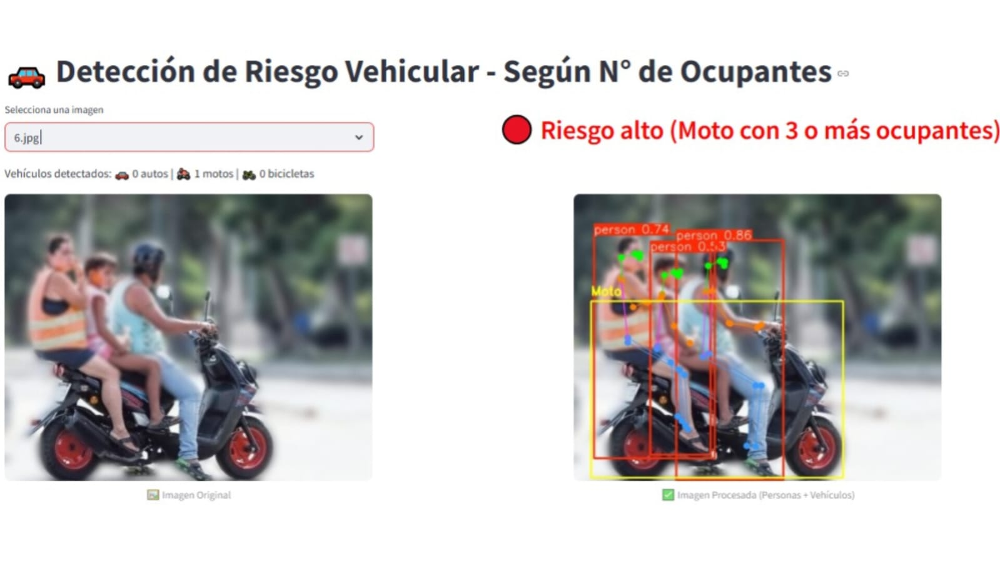
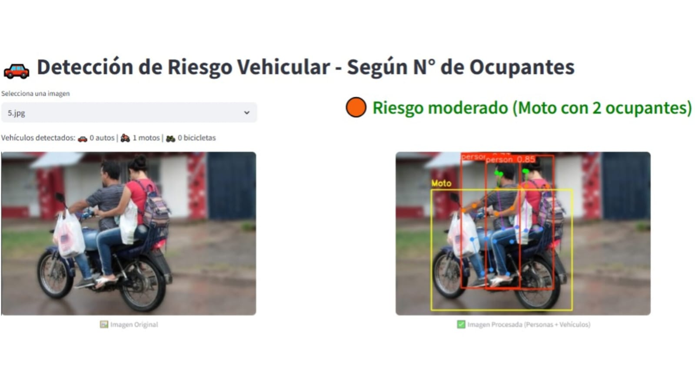
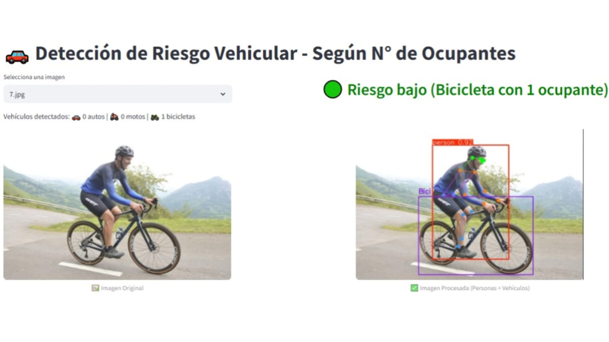
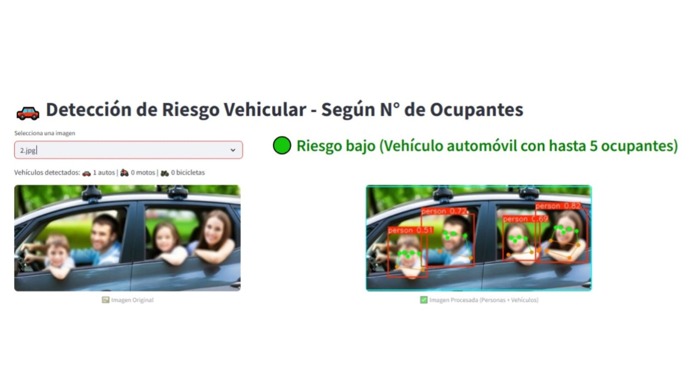
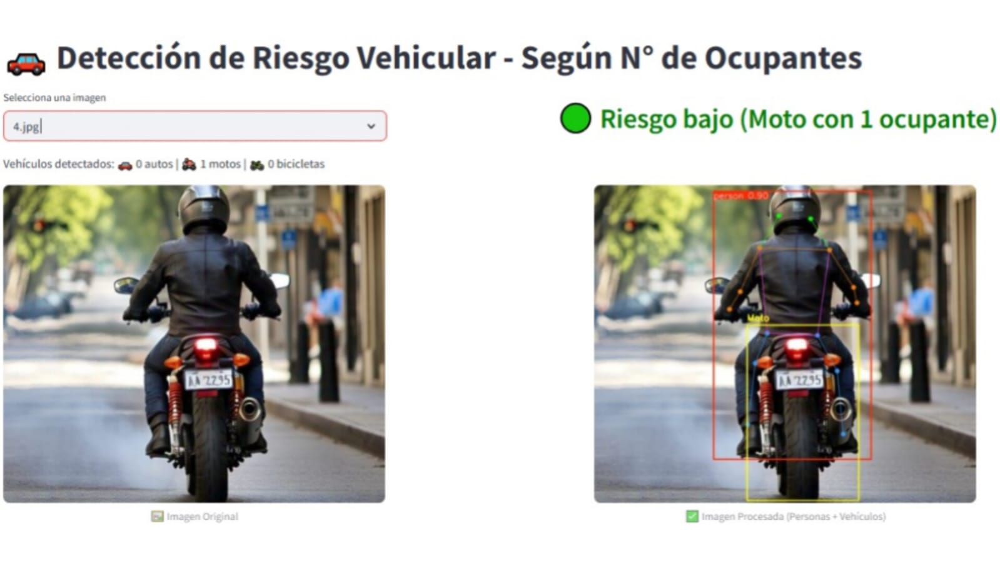

# 🚗 Detección de Riesgo Vehicular por Ocupantes usando Visión Artificial

### Análisis automático de riesgo en imágenes con autos, motos y bicicletas mediante detección de personas y vehículos.

## 🧠 Introducción

Este proyecto implementa un sistema de visión artificial que analiza imágenes con vehículos (autos, motos y bicicletas) y evalúa el nivel de riesgo en función del número de ocupantes. Utiliza modelos de detección de objetos y poses humanas para identificar vehículos y personas, y clasifica el riesgo como **bajo**, **moderado** o **alto**, según la relación entre tipo de transporte y cantidad de personas detectadas.

Esta herramienta puede aplicarse tanto en prevención de accidentes como en seguridad pública.

## ⚙️ Casos de uso

- **Seguridad vial**: detectar motocicletas con más de dos ocupantes o bicicletas sobrecargadas.
- **Prevención del delito**: identificar patrones comunes como motos con múltiples ocupantes (*motochorros*).
- **Análisis urbano**: estudio de comportamientos de tránsito en entornos urbanos a partir de imágenes.

## 🛠️ Tecnologías utilizadas

- 🖼️ **OpenCV y PIL** – Procesamiento y visualización de imágenes.
- 🔍 **YOLOv8 (Ultralytics)** – Detección de objetos y poses humanas.
- 🌐 **Streamlit** – Interfaz web interactiva.
- 🧮 **NumPy** – Operaciones numéricas.
- 🐍 **Python 3.10+**

## 📁 Estructura del proyecto

📂 IMG/ # Carpeta con imágenes de prueba
├── 1.jpg
├── 2.jpg
...

📄 app.py # App principal con interfaz Streamlit
📄 logica.py # Clasificación del riesgo según vehículo y personas
📄 auto.py # Detección y conteo de autos
📄 moto.py # Detección y conteo de motos
📄 bici.py # Detección y conteo de bicicletas

## ▶️ ¿Cómo ejecutar?

1. Colocar las imágenes a analizar en la carpeta `IMG/`. (Ya se encuentran Precargadas)
2. Instalar las dependencias necesarias: "pip install ultralytics streamlit opencv-python pillow numpy"

Ejecutar la app: streamlit run app.py

Seleccionar una imagen desde la interfaz (Ya se encuentran Precargadas de la carpeta `IMG/`) y visualizá el análisis de riesgo.

## 📌 Notas
Se utilizan modelos livianos (yolov8n.pt y yolov8n-pose.pt) para mayor rapidez en la inferencia.

Las clases del dataset COCO se usan para identificar vehículos:

bicycle = 1, car = 2, motorcycle = 3.

## 📷 Ejemplo de salida

Imagen original vs imagen procesada (con detección de personas y vehículos).

Evaluación del riesgo: bajo, moderado o alto según reglas definidas por tipo de vehículo y número de ocupantes.

## 📸 Capturas de pantalla - Funcionamiento

### Moto con 3 ocupantes  
  

### Moto con 2 ocupantes  
  

### Bicicleta con 1 ocupante  
  

### Automóvil con hasta 5 ocupantes  
  

### Moto con 1 ocupante  
  

## 🙌 Sobre el proyecto

Este proyecto fue desarrollado con el objetivo de aplicar visión artificial a un problema real y contextualizado.  
Forma parte de mi portafolio como desarrollador enfocado en crear soluciones accesibles mediante visión por computadora aplicada.  

¡Todo feedback es bienvenido!
